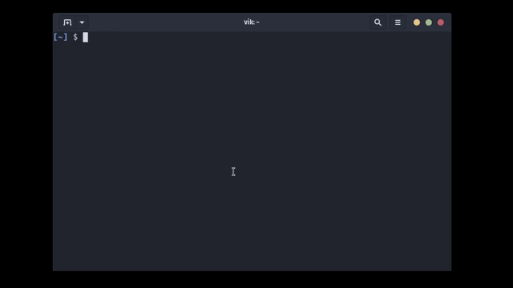

# Kindle Highlights



Extracts all your Amazon Kindle highlights

## TODO

- [x] Make the program more efficient
- [x] JSON Output
- [x] Remove keys of empty lists
- [x] Make executable
- [x] Install geckodriver dependency instruction
- [x] prompt.py argparse is never used, provide bash man
- [x] Highlights from a specific book (search algo or regex)
- [x] book search: multi-word search
- [x] Remove useless highlights on the kindle site
- [x] Add a setup script
- [ ] Replace .json file with a database (sqlite3)

## Setup

```bash
# Clone dir
git clone https://github.com/lostvikx/kindle-high.git
```

Run the setup script.

```bash
cd kindle-high && ./setup
```

Selenium requires additional browser drivers. Download them from [here](https://www.selenium.dev/documentation/webdriver/getting_started/install_drivers/).


## Usage

Prints a cool annotation from your kindle highlight. Also, it fetches the highlights if they aren't present locally.

```bash
kindle-high
```

For help.

```bash
kindle-high --help
```

To update the local `highlights.json` file.

```bash
kindle-high -u
```

### Bonus usage of ffmpeg (unrelated)

First use of ffmpeg program!

```bash
# Converts a video file to a fast-forwarded gif
ffmpeg -ss 1 -t 3 -i <video-file-name>.mp4 -vf "fps=10,scale=640:-1:flags=lanczos,split[s0][s1];[s0]palettegen[p];[s1][p]paletteuse" -loop 0 showcase.gif
```

### Create a virtual environment

```bash
python -m venv venv
# Activate virtual environment
. venv/bin/activate
```
