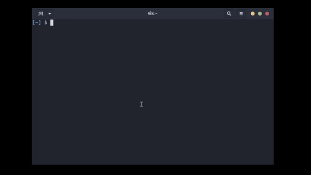

# Kindle Highlights



Extracts all your Amazon Kindle highlights

## ToDos

- [x] Make the program more efficient
- [x] JSON Output
- [x] Remove keys of empty lists
- [x] Make executable
- [x] Install geckodriver dependency instruction
- [ ] Remove useless highlights on the kindle site
- [ ] Highlights from a specific book (search algo or regex)
- [ ] prompt.py argparse is never used, provide bash man

## Setup

```bash
# Clone dir
git clone https://github.com/lostvikx/kindle-high.git
# Install dependencies
pip install -r ./kindle-high/requirements.txt
```

Selenium requires additional browser drivers. Download them from [here](https://www.selenium.dev/documentation/webdriver/getting_started/install_drivers/).

Then, add this line at the end of your `.bashrc` file

```bash
export KINDLE_HIGH="/home/<your-name>/<path-to-directory>/kindle-high/"
```

## Usage

Prints a cool annotation from your kindle highlight. Also, it fetches the highlights if they aren't present locally.

```bash
kindle-high
```

To update the local `highlights.json` file.

```bash
kindle-high -u
# OR
kindle-high --update-highlights
```

For further help.

```bash
kindle-high --help
```

### Bonus usage of ffmpeg (unrelated)

First use of ffmpeg program!

```bash
# Converts a video file to a fast-forwarded gif
ffmpeg -ss 1 -t 3 -i <video-file-name>.mp4 -vf "fps=10,scale=640:-1:flags=lanczos,split[s0][s1];[s0]palettegen[p];[s1][p]paletteuse" -loop 0 showcase.gif
```
